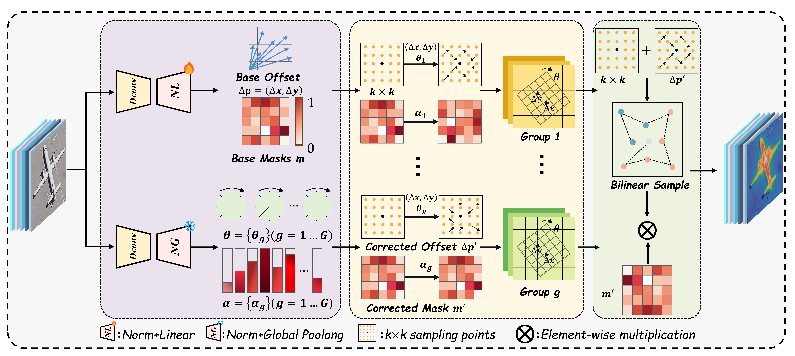

<div align="center">
    <div>&nbsp;</div>
  
  <div>&nbsp;</div>

[](LICENSE)
[](https://pytorch.org/)
[](https://github.com/open-mmlab/mmrotate)


</div>

## 📝 Introduction

**RAPTOR** (Rotation-Aware Dual-Branch Mamba Fusion Network) is an efficient backbone network architecture specifically designed for **Oriented Object Detection** in military remote sensing images.

Addressing the challenges of extreme geometric variability, ambiguous context, and feature degradation in military remote sensing, RAPTOR proposes a dual-branch architecture that decouples local geometric modeling from global context aggregation. It significantly improves detection accuracy for rotating objects in complex environments while maintaining linear computational complexity.

### 🌟 Key Highlights
* **Parallel Local-Global Fusion Block (PLGFB)**: Collaborates two specialized branches for feature extraction. The **GR-DC** (Grouped Rotation-Deformable Convolution) branch dynamically predicts rotation angles to adapt to object contours, while the **RVMB** branch utilizes the linear complexity of Vision Mamba to capture global context.
* **LoGGS Guided Stem**: Adopts Laplacian-of-Gaussian (LoG) filters to enhance edge priors and suppress noise at the input stage.
* **ADRFD Downsampling Module**: Introduces Adaptive Dynamic Routing Fusion Downsampling to intelligently preserve fine-grained details and drastically reduce spatial information loss.
* **Military-RSOD Dataset**: Constructed a large-scale military remote sensing dataset with precise Oriented Bounding Box (OBB) annotations. The full research version contains **53 fine-grained categories** and 18,195 images; the public downloadable version has been adjusted under confidentiality requirements.

---

## 🚀 Performance at a Glance

Comparison of RAPTOR with current state-of-the-art (SOTA) methods on the **Military-RSOD** dataset:

| Stage | Method | Backbone | FLOPs (G) | mAP (%) |
| :--- | :--- | :--- | :---: | :---: |
| **One-Stage** | R³Det | ResNet-50 | 346.8 | 81.19 |
| | SASM | ResNet-50 | - | 82.08 |
| | O-RepPoints | ResNet-50 | 194.4 | 82.42 |
| | R³Det-GWD | ResNet-50 | 336.2 | 82.64 |
| | R³Det-KLD | ResNet-50 | 336.2 | 83.26 |
| | S²ANet | ResNet-50 | 199.8 | 81.02 |
| | S²ANet | LEGNet-S | 175.3 | 83.46 |
| | S²ANet | LSKNet-S | 164.3 | 83.80 |
| | S²ANet | PKINet-S | 502.6 | 83.86 |
| | **S²ANet** | **RAPTOR (Ours)** | **161.53** | **84.16** |
| **Two-Stage** | CenterMap | ResNet-50 | 198.4 | 80.56 |
| | SCRDet | ResNet-50 | - | 81.50 |
| | Roi Trans. | ResNet-50 | 225.4 | 84.26 |
| | Strip R-CNN | StripNet | 218.3 | 85.39 |
| | O-RCNN | ResNet-50 | 211.4 | 83.89 |
| | O-RCNN | LSKNet-S | 173.6 | 84.84 |
| | O-RCNN | DecoupleNet | 142.4 | 84.47 |
| | O-RCNN | LEGNet-S | 184.6 | 85.42 |
| | **O-RCNN** | **RAPTOR (Ours)** | **172.55** | **86.47** |

---

### Model Weights
- **Backbone Pretrained Weights**: [RAPTOR_pretrained.pth](https://pan.baidu.com/s/1PKkOrCyh2CCEnL2c1zRVAQ) (Access Code: `d3mj`)
- **Trained Model Weights**: [best.pth](https://pan.baidu.com/s/1RcrNQR6i-_Qdto8hE2TA6g) (Access Code: `qhek`)

## 📂 Military-RSOD Dataset

The dataset covers a full range of sea, land, and air military targets, enabling the evaluation of model generalization in complex military scenarios:
* **Air Targets**: Strategic bombers (B-1B, TU-160), Transports (C-17), 5th-gen Fighters (F-35, SU-35), etc.
* **Sea Targets**: Nimitz-class aircraft carriers (NAA), Arleigh Burke-class destroyers (ABD), submarines, auxiliary ships.
* **Ground Facilities**: Armored Fighting Vehicles (AFV), Military Construction Vehicles (MCV), bridges, airport facilities.

Due to confidentiality agreements, the publicly downloadable version of Military-RSOD has been adjusted and some categories have been removed. The reported experimental results are based on the full research version described in the paper.

### 📥 Dataset Download
- **Baidu Netdisk**: [Military-RSOD_split.tar.gz](https://pan.baidu.com/s/16r-UM9I0-wNfc_2COJXZNw) (Access Code: `jxdv`)

---

## 🛠️ Installation

This project is built based on [MMRotate 0.3.4](https://github.com/open-mmlab/mmrotate).

1. **Environment Preparation**:
```shell
# Recommended installation version
conda create -n openmmlab python=3.7 pytorch==1.7.0 cudatoolkit=10.1 torchvision -c pytorch -y
conda activate openmmlab
pip install openmim
mim install mmcv-full
mim install mmdet
git clone [https://github.com/open-mmlab/mmrotate.git](https://github.com/open-mmlab/mmrotate.git)
cd mmrotate
pip install -r requirements/build.txt
pip install -v -e .
